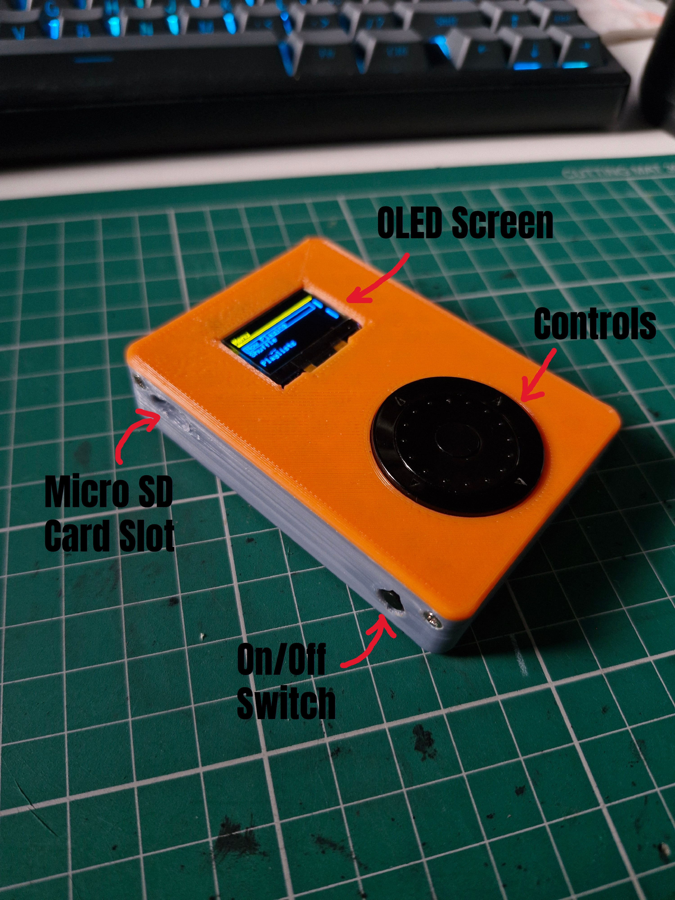

# ESP32 MP3 Player

A portable MP3 player built on the Adafruit ESP32 Feather V2. Audio output is through an AUX jack on the bottom of the device (can me seen in images/Now Playing.jpg). It plays MP3 files from an SD card through an I2S DAC, with an OLED interface driven by a rotary encoder and five buttons. Includes a play queue, shuffle, and a (work-in-progress) Bluetooth output.

## Features

- MP3 playback from SD card via I2S DAC output
- 128×64 SSD1306 OLED interface with scrolling text for long song titles
- Rotary encoder + 5-button navigation
- Recursive SD card scan for `.mp3` files (up to 64 songs)
- Play queue (up to 32 tracks) with add, skip, and play-from-queue
- Fisher–Yates shuffle across the whole library
- Volume control with on-screen volume bar
- BLE device scanning and a saved-devices list (in progress)

## Hardware

- **Board:** Adafruit ESP32 Feather V2 w.FL Antenna - 8MB Flash + 2 MB PSRAM
- **Display:** 0.96" SSD1306 128×64 OLED module (I2C)
- **DAC:** Adafruit PCM5100 I2S DAC with line-level output (100dB SNR)
- **Storage:** MicroSD card breakout board (SPI)
- **Input:** ANO Directional Navigation and Scroll Wheel rotary encoder (encoder + center button + 5-way directional presses)
- **Buttons:** One Mini On/Off Push-Button Switch

### Misc

- Prototyping wire (6-spool stranded core set)
- Double-sided foam tape for mounting
- 3D-printed enclosure/shell
- 6mm screws (enclosure assembly)

### Pinout

| Function        | Pin              |
|-----------------|------------------|
| OLED SDA / SCL  | 22 / 20          |
| Encoder A / B   | 25 / 14          |
| Buttons (C/D/R/U/L) | 13 / 26 / 32 / 27 / 33 |
| SD CS / SCK / MISO / MOSI | 4 / 5 / 21 / 19 |
| I2S WS / DOUT / BCLK | 15 / 8 / 7   |
| On/Off Switch   | EN               |

## Dependencies

Install these libraries through the Arduino Library Manager (or PlatformIO):

- `Adafruit GFX`
- `Adafruit SSD1306`
- `RotaryEncoder` (Matthias Hertel)
- `arduino-audio-tools` (with the MP3 Helix codec)
- ESP32 Arduino core (provides `SD`, `SPI`, `Wire`, and the BLE stack)

## Getting Started

1. Format a microSD card as FAT32 and copy your `.mp3` files onto it. A `/Music` folder works, but the scanner walks the whole tree recursively.
2. Wire the hardware according to the pinout above.
3. Open the sketch in the Arduino IDE, select the **Adafruit ESP32 Feather V2** board, and upload.
4. On boot the serial monitor (115200 baud) reports OLED, SD, and song-scan status.

## Controls

| Input         | Action                                                        |
|---------------|---------------------------------------------------------------|
| Rotary encoder | Move the selection in the current menu                       |
| Center        | Select / confirm (open menu item, play song, start BLE scan)  |
| Up / Down     | Volume up / down                                              |
| Right         | Add song to queue (Songs screen) / skip to next (Now Playing) |
| Left          | Back / return to main menu                                    |

## Menus

- **Now Playing** — current track and upcoming queue
- **Shuffle** — shuffles the whole library into the queue and starts playing
- **Songs** — browse and play/queue individual tracks
- **Playlists** — placeholder
- **Bluetooth** — scan for and list BLE devices (in progress)
- **Settings** — placeholder

## Limits

Defined near the top of the sketch and easy to adjust:

- `MAX_SONGS` — 64 tracks
- `MAX_QUEUE` — 32 queued tracks
- `MAX_SCAN_DEVICES` — 20 BLE scan results

## Known Limitations / TODO

- Bluetooth audio output is not yet implemented (scanning only).
- Playlists and Settings screens are placeholders.
- Only `.mp3` files are supported.
- `String`-based queue can fragment heap on ESP32 with large libraries; a fixed `char` buffer is a planned improvement.
